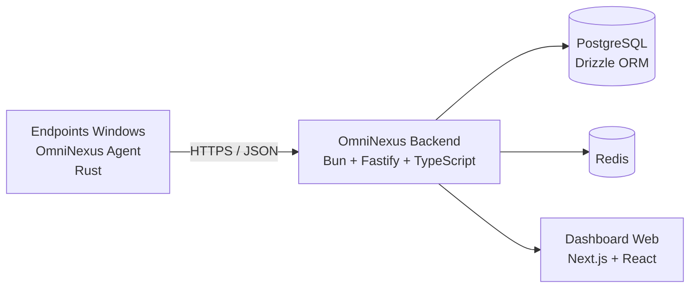

# Lucas Camargo Stivan

### Engenheiro de Software Full Stack · Arquiteto de Sistemas · DevOps

Construo produtos e plataformas resilientes combinando **engenharia de software**, **arquitetura distribuída**, **automação** e **cibersegurança**.

  
  
  

---

## Sobre mim

Sou **Engenheiro Full Stack** e **Arquiteto de Sistemas**, com foco na criação de soluções escaláveis, seguras e sustentáveis. Gosto de transformar problemas complexos em sistemas bem estruturados, com APIs consistentes, automação de entrega e observabilidade desde o início do projeto.

Atualmente, concentro meus estudos e projetos em **sistemas RMM (Remote Monitoring and Management)**, **telemetria de endpoints**, **cibersegurança**, **microsserviços** e **sistemas distribuídos**. Minha abordagem combina pragmatismo de produto com rigor técnico: decisões simples quando possível, arquitetura robusta quando necessário.

| Perfil | Detalhes |
| --- | --- |
| **Localização** | Ivaiporã, Paraná — Brasil |
| **Idiomas** | Português nativo · Inglês profissional · Espanhol básico |
| **Especialidades** | Full Stack · Arquitetura de sistemas · DevOps · RMM · Cibersegurança |
| **Principais ecossistemas** | Node.js · TypeScript · Bun · Rust · React |
| **Disponibilidade** | Projetos, parcerias técnicas e oportunidades globais |

---

## Projeto em destaque: OmniNexus

O **OmniNexus** é um ecossistema de monitoramento e gerenciamento remoto de endpoints. A solução é organizada em componentes independentes para agente, backend e dashboard, permitindo evoluir cada camada sem perder clareza arquitetural. [1] [2] [3]

### Arquitetura em alto nível

### Componentes do ecossistema

| Repositório | Responsabilidade | Tecnologias em destaque |
| --- | --- | --- |
| [**omninexus-agent**](https://github.com/Stivan-Lucas/omninexus-agent) | Agente para Windows responsável por enrollment, inventário, telemetria, heartbeat, fila offline e execução de comandos autorizados. | Rust · Windows Service · `sysinfo` · PowerShell/CMD |
| [**omninexus-backend**](https://github.com/Stivan-Lucas/omninexus-backend) | Core da plataforma para receber, validar, persistir e disponibilizar dados de telemetria e comandos. | Bun · Fastify · TypeScript · Zod · Drizzle ORM · PostgreSQL · Redis |
| [**omninexus-frontend**](https://github.com/Stivan-Lucas/omninexus-frontend) | Dashboard responsivo para acompanhar agentes e visualizar telemetria em tempo real. | Next.js · React · Tailwind CSS · Radix UI · Lucide |

### Desafios técnicos explorados

O projeto reúne problemas práticos de engenharia, como comunicação confiável entre agentes e servidor, operação offline, identidade por dispositivo, controle de comandos, persistência de telemetria, segurança de endpoints e visualização de dados em tempo real.

---

## Stack e competências

### Linguagens e runtimes

  
  
  
  
  
  
  

### Desenvolvimento de aplicações

| Camada | Tecnologias e práticas |
| --- | --- |
| **Backend** | Fastify · Express · NestJS · APIs REST · autenticação · validação de dados · microsserviços |
| **Frontend** | React · Next.js · Angular · Tailwind CSS · Radix UI · dashboards responsivos |
| **Mobile** | React Native · Expo · Flutter |
| **Dados** | PostgreSQL · MySQL · MongoDB · SQLite · Redis · Drizzle ORM · Prisma |
| **Sistemas** | Rust · Windows Services · telemetria · comunicação HTTP/JSON · filas offline |
| **Qualidade** | Testes unitários · testes E2E · linting · formatação · Conventional Commits · Semantic Release |

### Infraestrutura e DevOps

  
  
  
  
  

Tenho especial interesse em **entrega contínua**, **automação operacional**, **hardening**, **observabilidade**, **documentação técnica** e na construção de sistemas que permaneçam fáceis de manter à medida que crescem.

---

## GitHub em números

  
  

---

## Vamos conversar?

Se você procura alguém para **projetar uma arquitetura**, **desenvolver uma plataforma**, **estruturar uma API** ou **automatizar uma operação**, será um prazer conversar sobre o problema e encontrar uma solução objetiva.

  <a href="mailto:lucamargostivan@gmail.com"><strong>lucamargostivan@gmail.com</strong></a>
  &nbsp;·&nbsp;
  <a href="https://wa.me/5543999171501"><strong>WhatsApp</strong></a>

  Construindo sistemas melhores, uma decisão técnica de cada vez.

---

## Referências

[1]: https://github.com/Stivan-Lucas/omninexus-agent "OmniNexus Agent — repositório oficial"
[2]: https://github.com/Stivan-Lucas/omninexus-backend "OmniNexus Backend — repositório oficial"
[3]: https://github.com/Stivan-Lucas/omninexus-frontend "OmniNexus Frontend — repositório oficial"
